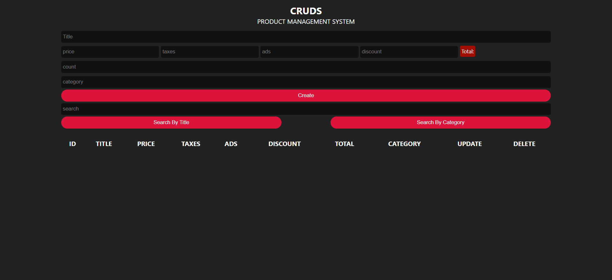

<h1 align="center">📦 CRUDS — Product Management System</h1>

<p align="center">
  <em>A simple, efficient, and responsive Product Management System built with pure HTML, CSS, and Vanilla JavaScript.</em>
</p>

<p align="center">
  
  
  
</p>

---

## 📖 Project Description

**CRUDS** is a comprehensive Product Management System designed to handle inventory and product data efficiently. Built entirely with **Vanilla HTML, CSS, and JavaScript** — this project showcases core programming logic, DOM manipulation, and local storage integration without relying on any external frameworks or libraries.

The application allows users to add new products, calculate totals including taxes and discounts, manage inventory counts, categorize items, and perform instant searches. All data is securely saved in the browser's Local Storage, ensuring persistence across sessions.

> 💡 **Why this project stands out:** It demonstrates fundamental JavaScript skills including CRUD operations (Create, Read, Update, Delete), array methods, local storage management, and dynamic DOM updates.

---

## 📸 Screenshots 🖼️

<div align="center">
  <table>
    <tr>
      <th align="center">Screen</th>
      <th align="center">🖥️ Desktop View</th>
      <th align="center">📱 iPad Pro</th>
      <th align="center">📲 iPhone 14 Pro Max</th>
    </tr>
    <tr>
      <td align="center"><strong>Application</strong></td>
      <td align="center"></td>
      <td align="center"></td>
      <td align="center"></td>
    </tr>
  </table>
</div>

---

## 📖 Table of Contents

- [🛠️ Technologies Used](#️-technologies-used-)
- [✨ Core Features](#-core-features)
- [📂 Folder Structure](#-folder-structure)
- [🚀 Installation Instructions](#-installation-instructions)
- [💻 How to Run](#-how-to-run)
- [🚀 Future Improvements](#-future-improvements)
- [✍️ Author](#️-author)

---

## 🛠️ Technologies Used 🎨

| Technology | Purpose |
|:---:|:---|
|  | **Structure** |
|  | **Styling** |
|  | **Logic & DOM Manipulation** |

---

## ✨ Core Features

### 🎯 Data Management
- ✅ **Create:** Add new products with title, price, taxes, ads, discount, and category.
- ✅ **Read:** Display all saved products in a responsive data table.
- ✅ **Update:** Modify existing product details easily.
- ✅ **Delete:** Remove individual products or delete all items at once.

### ⚙️ Functionality
- ✅ **Real-time Calculations:** Automatically calculates the final price based on initial price, taxes, ads, and discounts.
- ✅ **Bulk Creation:** Ability to create multiple instances of the same product at once using the `count` field.
- ✅ **Instant Search:** Filter products dynamically by Title or Category.
- ✅ **Local Storage:** Data is saved in the browser's `localStorage` and persists after page reloads.
- ✅ **Input Validation:** Ensures required fields are filled before adding data.

---

## 📂 Folder Structure

```
CRUDS/
│
├── 📄 index.html               # Main entry point — UI layout
├── 📄 README.md                # Project documentation
│
├── 📁 css/
│   └── 🎨 style.css            # All styles and responsive design
│
└── 📁 js/
    └── 📜 script.js            # Main application logic (CRUD operations)
```

---

## 🚀 Installation Instructions

### Prerequisites
- Any modern web browser (Chrome, Firefox, Safari, Edge)
- A code editor (VS Code recommended)

### Steps

**1. Clone the repository:**
```bash
git clone https://github.com/waleedtarbosh/CRUDS.git
```

**2. Navigate to the project directory:**
```bash
cd CRUDS
```

**3. Open in your browser:**
Simply open the `index.html` file in any modern web browser.

---

## 💻 How to Run

### Option 1: Direct Open
Double-click on `index.html` to open it in your default web browser.

### Option 2: Live Server (VS Code)
1. Install the "Live Server" extension in VS Code.
2. Right-click on `index.html`.
3. Select "Open with Live Server".

---

## 🚀 Future Improvements

- [ ] 🎨 **Enhanced UI:** Improve visual aesthetics and animations.
- [ ] 📱 **Mobile Optimization:** Ensure tables scroll and fit perfectly on small screens.
- [ ] 📤 **Export Data:** Ability to export products to CSV or PDF.
- [ ] 🌙 **Dark Mode Toggle:** Add a theme switcher.
- [ ] 📊 **Dashboard Analytics:** Show total inventory value and item counts.

---

## ✍️ Author

<p align="center">
  <a href="https://github.com/waleedtarbosh">
    
  </a>
</p>

<p align="center">
  <strong>Waleed Tarbosh</strong><br/>
  Front-End Developer<br/>
</p>

---

<p align="center">
  <a href="#-cruds--product-management-system">⬆️ Back to Top</a>
</p>
